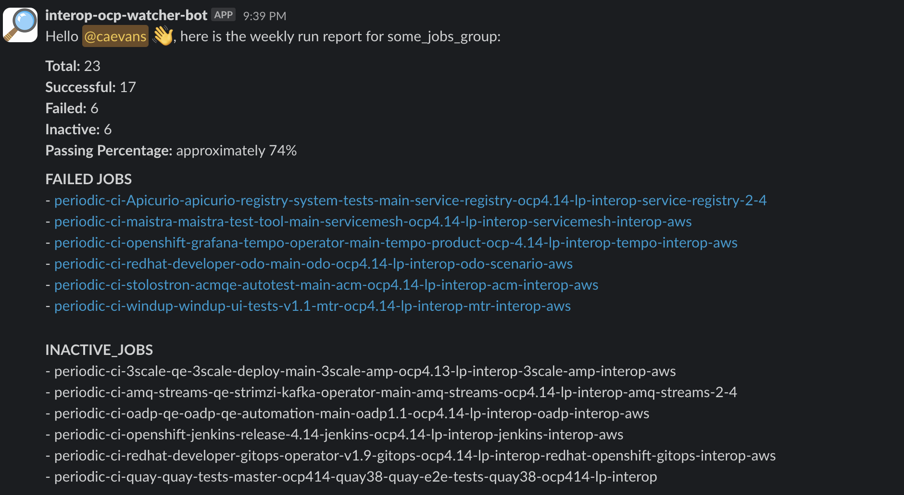

# interop-ocp-watcher-bot

This bot is meant to send weekly messages to the CSPI Interop team regarding their OCP test results. The bot will run in an OpenShift CI job a few hours after the weekly triggering job has been executed.

## Usage

### Requirements

1. You will need a JSON list of jobs. CSPI Interop currently uses the [`trigger-jobs` ref](https://github.com/openshift/release/tree/master/ci-operator/step-registry/trigger-jobs) in OpenShift CI to trigger our jobs, this ref uses the same list of jobs you will need to execute this tool. An example of this file can be found at [`development/example_jobs.json`](./development/example_jobs.json).
2. A webhook URL to send to the message to. All interop webhook URLs are stored in the [`cspi-interop-watcher-bot/secrets`](https://vault.ci.openshift.org/ui/vault/secrets/kv/show/selfservice/cspi-interop-watcher-bot/secrets) vault.
3. A group ID to mention in the message. The group ID for `ocpci-lp-interop` is also stored in the [`cspi-interop-watcher-bot/secrets`](https://vault.ci.openshift.org/ui/vault/secrets/kv/show/selfservice/cspi-interop-watcher-bot/secrets) vault. If you would like to use a different group, find the ID using [this Slack documentation](https://api.slack.com/reference/surfaces/formatting#mentioning-groups).
4. Some container platform, either Docker or Podman, should be installed on the machine running the bot.

### How to Execute Locally

1. Add your list of jobs to the `development` folder.
2. Run the following command, replacing the arguments with the appropriate values. The value for `jobe_file_path` will be `job_file_path="/tmp/NAME_OF_JSON_LIST.json` where `NAME_OF_JSON_LIST.json` is the name of the file you created in step 1.

```bash
$ make job_file_path="/some/path" mentioned_group_id="someID" webhook_url="https://some.url" job_group_name="some_group_name" container-build-execute
```

### How to Use in OpenShift CI

If you would like to use this tool in OpenShift CI (it was built for this purpose), use the following job template to configure a new message to be sent.

```yaml
- as: ocp-self-managed-lp-watcher-bot-message
  cron: 0 20 * * 1
  steps:
    cluster_profile: aws-cspi-qe
    env:
      WATCHER_BOT_JOB_GROUP_NAME: "OCP Self Managed Layered Product Scenarios"
      WATCHER_BOT_JOB_FILE: "self-managed-lp-interop-jobs"
    test:
    - ref: trigger-jobs-interop-ocp-watcher-bot-send-message
```

### CLI Options Definition

- `job_file_path`: Used to define the path to the JSON file containing the list of jobs.
- `mentioned_group_id`: The group ID of the Slack user group to mention in the message that is sent. Find the ID using [this Slack documentation](https://api.slack.com/reference/surfaces/formatting#mentioning-groups).
- `webhook_url`: The webhook URL to send the message to. All interop webhook URLs are stored in the [`cspi-interop-watcher-bot/secrets`](https://vault.ci.openshift.org/ui/vault/secrets/kv/show/selfservice/cspi-interop-watcher-bot/secrets) vault.
- `job_group_name`: This value you can be anything you want, it is basically a way for us to determine which list of jobs we used to gather the data. We will need to configure this for each "trigger" we use. For example, we will have one for self-managed, one for hypershift, one for OCP deployment.next...

## Example

Here is an example of the message sent:


